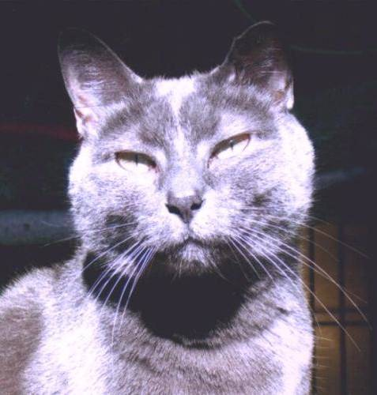
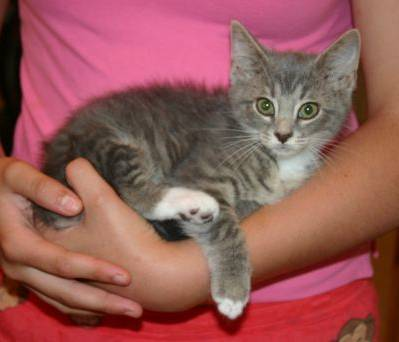
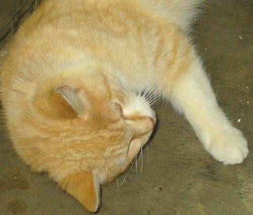
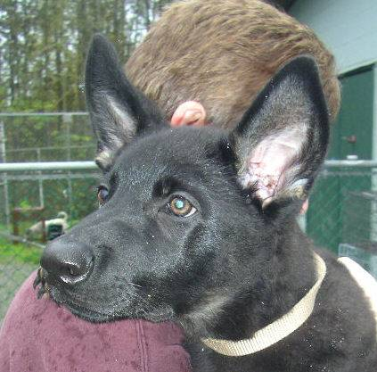
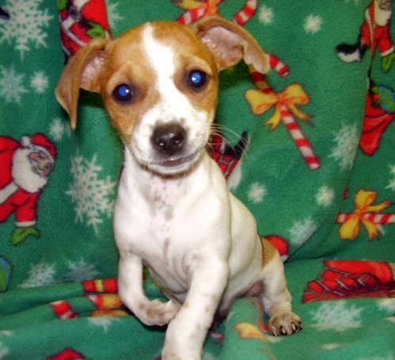
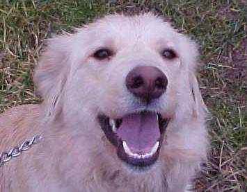
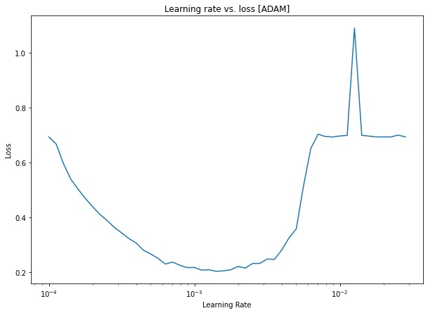
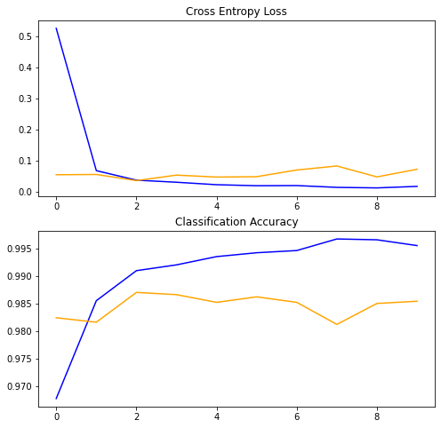

# Dogs-And-Cats-98.88

In this repo I will show you my neural network model. This model is predicts if the animal in picture is dog or cat, and trained with [dogs and cats dataset](https://www.kaggle.com/c/dogs-vs-cats/data). I used transfer learning technique, otherwise I couldn't get test accuracy above 87% (with 100x100 size). But with the help of transfer learning I got 98.88 accuracy (250x250).

## Required libraries
- As you can see, I used _Mobile Net_ architecture for this model.
- ModelCheckpoint is for saving the weights that perform best on validation data.
- ImageDataGenerator is used for better memory performance. I have 16gb ram, that's why I can't upload all the images at 250x250 pixel. So, with the help of that function I don't need to upload all the images at once. They will come from disk when they needed.

## Preparing data
Firstly, I chose 250 pixel for width and height. Decreasing pixel can cause lower accuracy. And, of course we can increase size to get better performance. For train data I used _preprocess_input_ attribute. It contains data preparation steps, such as normalizing. 

I used categorical _class_mode_ , because I have 2 neurons in output layer.

:file_folder: Dataset size:
- For train dataset: 10000 dog and 10000 cat images, in total 20000 images.

- For test dataset:  2500  dog and 2500  cat images, in total 5000 images.

:mag: Some examples from dataset:

  
  
  
  
  
  

## Creating model
Firstly, I used MobileNetV2 for first layers. I didn't want to change weigth, so made layers untrainable. Then I added some dense layers (with relu activation function) and output layer with 2 layer. For regularizing I used dropout.

As a optimizer I chose _Adam_ optimizer. I had function that tests different learning rates and compares losses. The result of model with different learning rates:

:chart_with_downwards_trend: From this graph, I chose local minima which is at 0.001 point.

Then model fitting stars, and as a validation data I chose the test data itself to see the accuracy I want. 

:chart_with_upwards_trend: Training process graphs:

So, our model got quite good performance.
